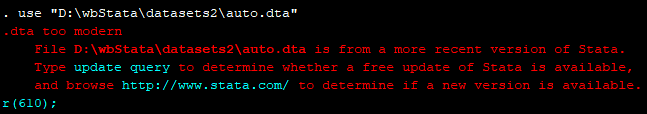

# wbStata

`wbStata` is a CLI utility to easily convert between (or, go way back to) versions of Stata's `.dta`, which are not forward compatible. 
* Cross-platform CLI utility: Windows, Mac, Linux.
* No knowledge of Python required (but requires a Python installation).
* Works with Python 3.6+.

## Statement of Need

Stata `.dta` data files are not forward compatible. 
This means you cannot use older versions (e.g., `Stata 13`) to read a `.dta` file exported from newer versions (e.g., `Stata 17`).

So what is one to do when you try to open a `dta` file in Stata and get a rude `dta too modern r(601)` error:
<details open><summary><em>...</em></summary>
  <p align="center"></p>
</details>

Find your way back to older versions of Stata `.dta` files with `wbStata`.
`wbStata` is a quick and dead simple CLI (command-line interface) to go way back with Stata data (`.dta`) files. You *do not need access to* newer `Stata` versions.


## Quick usage

* **Simple and Single-line command-line usage:**
  * Convert the `auto.dta` file so that you can open it in Stata 13
    <pre>$ wbstata auto.dta --version 13 --verbose</pre>
  
  * Convert all `dta` files in the path so that you can open it in Stata 13
    <pre>$ wbstata --all --version 13 --verbose</pre>
  

* **Let `wbStata` prompt you for relevant settings:** <br>
  (press enter to accept default settings in brackets)
  * `dta file(s)` [*]: `dta file(s)` to be converted 
  * `version` [13]: `version` to convert to (or the `Stata` version you have)


## More about the problem
<details open><summary><em>Assortment of enquires about the error</em></summary>
  
  * [[1]](https://www.stata.com/support/faqs/data-management/save-for-previous-version/) Stata support FAQs: How can I save a Stata dataset so that it can be read by a previous version of Stata?
  * [[2]](https://www.statalist.org/forums/forum/general-stata-discussion/general/1440296-how-to-read-a-stata-15-data-file-in-stata-13) how to read a stata 15 data file in stata 13.
  * [[3]](https://www.statalist.org/forums/forum/general-stata-discussion/general/1326849-how-to-open-stata-14-files-in-stata-12-13) How to open stata 14 files in Stata 12-13.
  * [[4]](https://www.statalist.org/forums/forum/general-stata-discussion/general/1373797-how-to-open-a-new-stata-dataset-version) How to open a new stata dataset version.
  * [[5]](https://www.statalist.org/forums/forum/general-stata-discussion/general/1363089-how-to-open-a-file-that-is-more-from-a-more-recent-version-of-stata-into-stata13) How to open a file that is more from a more recent version of Stata into Stata13.
  * [[6]](https://www.reddit.com/r/stata/comments/4ufos2/convert_stata_14_dta_file_t) Convert Stata 14 .dta file to Stata 13.
</details>  

## Alternative solutions
Based on proposed solutions in [More about the problem](#more-about-the-problem).
* [[0]](https://www.stata.com/manuals/dsave.pdf) Use Stata's `saveold` (but for this you first need access to the new Stata version. Read in the `dta` file. Save it using `saveold`. Then use the converted `dta` file in your older Stata version).
* [[1]](https://stattransfer.com/) Stat/Transfer (proprietary).
* [[2]](https://cran.r-project.org/web/packages/haven/index.html) R's `Haven`.

## About this utility
`WbStata` is an open source utility that wraps around [`click`](https://click.palletsprojects.com/) and [`pandas`](https://github.com/pandas-dev/pandas)'s [`DataFrame.to_Stata`](https://pandas.pydata.org/docs/reference/api/pandas.DataFrame.to_stata.html) utility. Using `wbStata`, easily convert new Stata `dta` files to older versions.

<details><summary><em>Show CLI help reference</em></summary>
  
  ```console
  $ wbstata -h
  Usage: wbstata [OPTIONS] <dta files>

    Find your way back to older versions of dta files.

    Convert newer Stata .dta files to older versions so that you can open them in older
    Stata versions.

  Options:
    -a, --all            Convert all dta files in path.
    -v, --version <int>  Which version of Stata to convert to.
    -s, --suffix <text>  Suffix to be added to converted file.
    -o, --output <text>  Name of converted .dta file (Single file conversion only).
                         Supercedes [suffix].
    -r, --recursive      Convert all .dta files in directory and subdirectories.
    -w, --overwrite      Over[w]rite original input .dta files.
    -ve, --verbose       Print messages.
    -h, --help           Show this message and exit.
  ```
</details>
  

